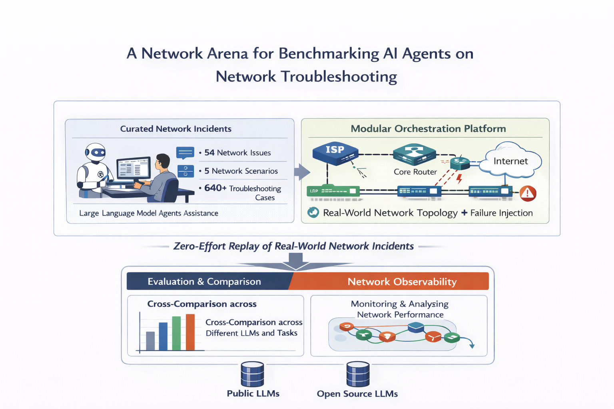

<div align="center">
<h1>A Network Arena for Benchmarking AI Agents on Network Troubleshooting</h1>

[🤖Overview](#🤖overview) | 
[📦Installation](#📦installation) | 
[🚀Quick Start](#🚀quick-start) | 
[🛠️Usage](#🛠️usage) | 
[📚Cite](#📚cite)

[](https://arxiv.org/abs/2512.16381)

</div>

<h1 id="🤖overview">🤖 Overview</h1>



This repository is a unified platform that can offer: 
1. A benchmark suite of curated network incidents that covers 54 realistic network issues, ranging from link and host failures to resource contention, and includes five network scenarios, four of which can be instantiated at different topology sizes, spanning campus and data center networks. By combining these dimensions, the benchmark yields 640 distinct troubleshooting incidents for evaluating AI agents. The benchmark can be further extended by randomizing failure locations and composing multiple issues within a single incident. 
2. A modular plug-and-play orchestration platform that connects AI agents with the network environment, enabling real-time troubleshooting in realistic conditions, and providing a human-facing interface to monitor agent performance.


💡 **Note:** We are actively developing this framework. If you have any suggestions or are interested in contributing, feel free to reach out to us!

## Features

- Standardized network troubleshooting environment based on Kathará
- MCP-based tool support
- Pre-built network scenarios and fault injection mechanisms
- Reproducible evaluation framework
- Support for various network topologies and configurations
- Easy integration of custom AI agents
- Automatic evaluation mechanism

<h1 id="📦installation">📦 Installation</h1>

## Requirements

- [Kathará](https://www.kathara.org/). 
  Follow the [official installation guide](https://github.com/KatharaFramework/Kathara?tab=readme-ov-file#installation) to install Kathará.
- Python >= 3.12


## Setup

Clone the repository and install the dependencies. 
NIKA uses [uv](https://docs.astral.sh/uv) to manage the dependencies. Follow [uv installation instructions](https://docs.astral.sh/uv/getting-started/installation/) to install uv. You can also use a standard `pip install -e .` to install the dependencies.

```shell
# Clone the repository
git clone https://github.com/sands-lab/nika
cd nika

# Install dependencies
uv sync

# Activate the environment
uv venv activate
```

The Kathará API relies on Docker to function properly. We recommend to add current user to docker group to avoid calling with `sudo`. **However, please be aware of the security implications of this action.**

```shell
sudo usermod -aG docker $USER
```

Login again or activate temporaily with 

```shell
newgrp docker
```

<h1 id="🚀quick-start">🚀 Quick Start</h1>

## Configure environment variables

Create a `.env` file under the base directory and set the following environment variables:

```shell
BASE_DIR = <your_path_to_this_project>

# if use Langsmith for observability
# check langsmith documentation for more details
LANGSMITH_TRACING="true"
LANGSMITH_ENDPOINT=<>
LANGSMITH_API_KEY=<>
LANGSMITH_PROJECT=<>

# if use langfuse for observability
# check langfuse documentation for more details
LANGFUSE_SECRET_KEY = <>
LANGFUSE_PUBLIC_KEY = <>
LANGFUSE_BASE_URL = "https://cloud.langfuse.com"

# api key for you LLM, e.g. DeepSeek here
DEEPSEEK_API_KEY=<>
OPENAI_API_KEY=<>

# if use ollama for llm 
OLLAMA_API_URL=<>
```

## Step by step guide
You can follow the steps below to run a complete troubleshooting task with NIKA.

1. **Start the network environment**
  Check the specific scenario and its parameters under `llm4netlab/net_env`.
   ```shell
   python3 scripts/step1_net_env_start.py --scenario <scenario_name> --scenario_params key1=value1 key2=value2
   ```

2. **Inject faults into the network environment**

   ```shell
   python3 scripts/step2_failure_inject.py --problem <problem_id>
   ```

3. **Run the AI agent to troubleshoot the network**
    ```shell
    python3 scripts/step3_agent_run.py --agent_type <agent_type> --backend_model <backend_model> --max_steps <max_steps>
    ```

4. **Evaluate the agent's performance**

    ```shell
    python3 scripts/step4_result_eval.py --judge_model <judge_model>
    ```

Alternatively, you can run the `benchmark/run_benchmark.py` script to execute all steps for all predefined incidents in the benchmark suite. This script will automatically start the network environment, inject faults, run the AI agent, and evaluate the results.


<h1 id="🛠️usage">🛠️ Usage</h1>

## Network Scenarios

This framework supports multiple network scenarios under the `nika/net_env` directory, including:

| Scenario                                 | Scalable | Description                                                        |
| ---------------------------------------- | -------- | ------------------------------------------------------------------ |
| Data center network (CLOS)               | ✓        | Multi-tier leaf–spine fabric with edge servers.                    |
| Campus network (3-tier)                  | ✓        | Enterprise core–distribution–access topology.                      |
| ISP backbone network (meshed)            | ✓        | Provider-style backbone with core and access nodes.                |
| SDN-enabled cloud POP fabric (CLOS/star) | ✓        | SDN fabric with centralized controller and edge switches.          |
| P4 programmable testbed                  | --       | Compact testbed for data-plane algorithms and pipeline validation. |


💡 More scenarios are WIP!

Each scenario is defined in a Kathará `lab.py` file, which specifies the network topology, devices, and initial configurations. Check [Kathará API Docs](https://github.com/KatharaFramework/Kathara/wiki/Kathara-API-Docs) for more details if you want to create your scenarios.

## Network issues

This framework provides a set of predefined issues that can be injected into the network environment. These issues are categorized into different types, each with specific root causes and key signals. By combining the issues with the network scenarios, randomlizing the failure locations, and composing multiple issues, this framework can generate multiple incidents based on a network issue (see # Incident column).
The following table summarizes the issues available in this framework:

| Category                               | Root Cause                              | Key Signals                                                     | # Incident |
| -------------------------------------- | --------------------------------------- | --------------------------------------------------------------- | ---------- |
| Link failures                          | Link flap                               | Flap event logs; packet drops                                   | 26         |
| Link failures                          | Link detached                           | Physical link not detected; PHY down                            | 26         |
| Link failures                          | Link down                               | Interface state down                                            | 26         |
| Link failures                          | Faulty cable                            | CRC errors; corrupted frames                                    | 26         |
| Link failures                          | MAC address conflict                    | Same MAC seen on multiple ports; MAC flapping logs              | 26         |
| Link failures                          | Link fragmentation disabled             | Large packets dropped; MTU mismatch                             | 26         |
| End-host failures                      | Conflicting VPN memberships             | Overlapping subnets; VPN servers unreachable                    | 3          |
| End-host failures                      | Host crash                              | Host unresponsive; no heartbeat; ping fails                     | 35         |
| End-host failures                      | Host IP conflict                        | Duplicate IP alerts; ARP conflict detected                      | 26         |
| End-host failures                      | Host IP misconfig                       | Incorrect or missing IP address; host unresponsive              | 68         |
| End-host failures                      | Incorrect netmask                       | Partial reachability; inconsistent routing behavior             | 16         |
| End-host failures                      | DNS empty answer                        | Incorrect or missing DNS records; NXDOMAIN                      | 6          |
| Network node errors                    | Number of MPLS labels hit limit         | Error logs; packet drops                                        | 1          |
| Network node errors                    | Switch/router crash (e.g., overheating) | Switch down and unreachable from MGMT                           | 20         |
| Network node errors                    | P4 program reads `invalid` header field | Packet drops; error logs (platform-dependent)                   | 8          |
| Network node errors                    | SDN controller crash                    | Switches isolated; new flows dropped                            | 6          |
| Network node errors                    | Southbound port unreachable             | OpenFlow/TCP 6633/6653 unreachable                              | 12         |
| Misconfigurations (routing, ACL, etc.) | BGP ASN mismatch                        | BGP session fails; ASN mismatch detected                        | 7          |
| Misconfigurations (routing, ACL, etc.) | BGP blackhole route leak                | Traffic to specific prefixes blackholed; unexpected AS path     | 7          |
| Misconfigurations (routing, ACL, etc.) | Missing BGP advertisement               | Prefix not propagated; missing announcements                    | 7          |
| Misconfigurations (routing, ACL, etc.) | Host static blackhole                   | Static blackhole route active; traffic dropped                  | 7          |
| Misconfigurations (routing, ACL, etc.) | OSPF area misconfiguration              | OSPF adjacency failure; area mismatch                           | 6          |
| Misconfigurations (routing, ACL, etc.) | OSPF neighbor missing                   | Missing neighbor; no Hello packets exchanged                    | 6          |
| Misconfigurations (routing, ACL, etc.) | Forwarding table entry misconfig        | No matching entry; default drop                                 | 8          |
| Misconfigurations (routing, ACL, etc.) | Flow rule loop                          | Traffic loop observed; CPU spike; port flooding                 | 6          |
| Misconfigurations (routing, ACL, etc.) | Flow rule shadowing                     | Lower-priority rule overridden by higher-priority rule          | 6          |
| Misconfigurations (routing, ACL, etc.) | ARP ACL block                           | ARP requests or replies dropped; ACL deny counters increase     | 26         |
| Misconfigurations (routing, ACL, etc.) | ICMP ACL block                          | ICMP traffic blocked; ping fails                                | 26         |
| Misconfigurations (routing, ACL, etc.) | Routing control-plane ACL block         | BGP (TCP/179) or OSPF (IP proto 89) blocked; neighborship fails | 13         |
| Misconfigurations (routing, ACL, etc.) | HTTP ACL block                          | HTTP 80/443 traffic blocked; client connection timeout          | 12         |
| Resource contention                    | Microbursts on interface                | Reduced throughput; queue buildup                               | 26         |
| Resource contention                    | Receiver saturated & slow               | Multiple segments ACKed per ACK; RWND < CWND                    | 12         |
| Resource contention                    | Incast traffic                          | Queue buildup; packet drops; retransmissions                    | 12         |
| Resource contention                    | Sender saturated & slow                 | Segments smaller than MSS; Flight size < min(CWND,RWND)         | 24         |
| Resource contention                    | Software middle-box overloads           | CPU usage saturates; queue buildup; RTT increases               | 3          |
| Network under attack                   | Service DoS                             | Surge in HTTP connections; CPU/RAM usage spikes                 | 18         |
| Network under attack                   | BGP hijacking                           | More specific or illegitimate prefixes appear; path anomaly     | 3          |
| Network under attack                   | DHCP spoofing                           | DHCP clients received spoofed configurations (IP, DNS, etc.)    | 9          |
| Network under attack                   | DNS spoofing                            | DNS points to wrong addresses                                   | 12         |
| Network under attack                   | ARP cache poisoning                     | Abnormal traffic redirection                                    | 26         |
| Network under attack                   | Misaligned sketch thresholds            | False-positive cardinality alerts (e.g., DoS); packet drops     | 1          |
| **Total**                              | -                                       | -                                                               | **640**    |

Based on the above issues, we disclose a large public dataset of AI agents’ behavior for network troubleshooting, with more than 900 reasoning traces. See the [](https://zenodo.org/records/17971675).

## MCP Servers and Tools

This framework provides a set of MCP servers and tools to facilitate network troubleshooting tasks. All servers are available under `src/nika/service/mcp_server`. These include:

- **base mcp server for Kathará**: This server provides the basic functionality for interacting with Kathará network scenarios, including
  - `get_reachability` to check the reachability by pinging all pairs of hosts.
  - `iperf_test` to run iperf test between any two hosts.
  - `systemctl_ops` to manage system services, i.e., start, stop, restart, status.
  - `get_host_net_config` to retrieve the network configuration of a specific host.
  - `nft_list_ruleset` to get the current nftables ruleset.
- **BMv2 mcp server**: This server provides functionality for interacting with BMv2 switches, including
  - `bmv2_get_log` to retrieve the log from a BMv2 switch.
  - `bmv2_get_counter_arrays` to retrieve the counter arrays from a BMv2 switch.
- **Frr mcp server**: This server provides functionality for interacting with FRRouting (FRR), including
  - `frr_get_bgp_conf` to retrieve the BGP configuration from a FRR instance.
  - `frr_get_ospf_conf` to retrieve the OSPF configuration from a FRR instance.
- **INT mcp server**: This server provides functionality for interacting with INT (In-band Network Telemetry) data stored in InfluxDB, including
  - `influx_list_buckets` to list all buckets in InfluxDB.
  - `influx_get_measurements` to retrieve the measurements from a specific bucket in InfluxDB.
  - `influx_query_measurement` to query data from InfluxDB.
- **Generic mcp server**: This server provides generic functionalities, including
  - `google_search` to perform a Google search.
- **Task management mcp server**: This server provides functionality for managing tasks and submissions, including
  - `list_avail_problems` to list all available problems for agent to solve.
  - `get_submission_template` to retrieve the submission template for a specific problem.
  - `submit` to submit a solution for a specific problem.

💡 More tools are coming soon...

You can also plug in your own MCP servers following the configuration instruction. Look for more MCP servers at [mcp.so](https://mcp.so/).

### Plug in the servers to your Claude desktop

#### Windows

Since the network environment and kathará run on Linux, and Claude desktop runs on Windows, we need some tricks here.

1. Modify the `xxx_mcp_server.py` files under `src/nika/service/mcp_server` as follows:
   
```python
mcp = FastMCP(name="kathara_base_mcp_server", host="127.0.0.1", port=8000)
... # your tools can be kept as is
mcp.run(transport="sse")
```

2. Run the server in VSCode terminal, it will automatically forward the port to Windows host, like 8000 -> 8000.

1. Configure Claude's config file `xx/claude_desktop_config.json` as follows:

```json
{
  "mcpServers": {
    "kathara_base": {
      "command": "npx",
      "args": [
        "mcp-remote",
        "http://127.0.0.1:8000/sse"
      ]
    }
  }
}
```

4. Enjoy!


## Logging and Observability

This framework supports to log and monitor agents with Langfuse, Laminar, and LangSmith, check [Langchain Callbacks](https://python.langchain.com/docs/concepts/callbacks/) for details.

### Customized Logger

This framework allows users to implement customized logging solutions tailored to their specific needs. This can be achieved by plugging the callback function to `mcp_use.MCPAgent`. For example, 

```python
from langchain.callbacks.base import BaseCallbackHandler

class FileLoggerHandler(BaseCallbackHandler):
    def __init__(self):
        super().__init__()
        self.logger = logging.getLogger(__name__)
        self.logger.setLevel(logging.INFO)
        file_handler = logging.FileHandler("mcp_use.log", encoding="utf-8")
        formatter = logging.Formatter("%(asctime)s [%(levelname)s] %(message)s")
        file_handler.setFormatter(formatter)
        self.logger.addHandler(file_handler)

    def on_llm_start(self, **kwargs):
        ...

    def on_llm_end(self, **kwargs):
        ...

    def on_tool_start(self,  **kwargs):
        ...

    def on_tool_end(self, **kwargs):
        ...

agent = MCPAgent(
    llm=llm,
    client=client,
    max_steps=max_steps,
    system_prompt_template=system_prompt_template,
    verbose=True,
    callbacks=[FileLoggerHandler()],
)
```

<h1 id="📚cite">📚 Cite</h1>

```bibtex
@misc{wang2025networkarenabenchmarkingai,
      title={A Network Arena for Benchmarking AI Agents on Network Troubleshooting}, 
      author={Zhihao Wang and Alessandro Cornacchia and Alessio Sacco and Franco Galante and Marco Canini and Dingde Jiang},
      year={2025},
      eprint={2512.16381},
      archivePrefix={arXiv},
      primaryClass={cs.NI},
      url={https://arxiv.org/abs/2512.16381}, 
}
```

# Acknowledgement

This project is largely motivated by [AIOpsLab](https://github.com/microsoft/AIOpsLab). We sincerely thank the authors for their excellent work.

# Licence

Licensed under the MIT license.